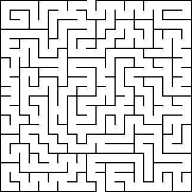
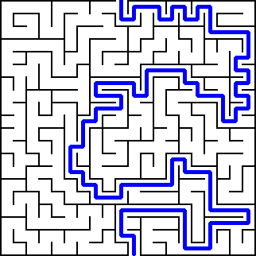

# Maze solver 
A small project to learn Python.

The script solves mazes similar to [Maze Generator](https://www.mazegenerator.net/)

## How to run
1.  Download a maze image from [www.mazegenerator.net](https://www.mazegenerator.net/) or use from Maze_example folder

2.  Run `maze_solver.py` 

- The programm will ask you to enter with the path to the maze image and to enter with the size of the mesh. 
    To run one of the examples, type the input `Maze_examples/20 by 20 orthogonal maze.png` and then `20 20`.

3. An image of the solution will be saved in the current folder. 
Following the example: "20_by_20_solved.png"

